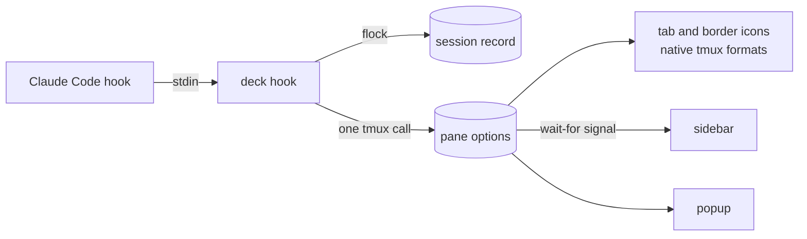

# tmux-agent-deck

See which Claude Code agents need you, which have finished, and which are still working, across every tmux session. Jump to any of them in one keystroke.

> **Status:** early preview (`v0.x`). It is used daily on a server with 11 sessions, 64 windows and 120 panes.

| State | Glyph | Meaning |
|---|---|---|
| waiting | ◆ white on red | Claude is blocked on you: a permission prompt or a question |
| running | ● green, pulsing | Claude is working, including background tasks it will resume from |
| done | ✔ blue | the turn finished while you were elsewhere; it clears when you look at the pane |
| idle | ○ grey | at its prompt, and you have seen it |

The running dot pulses in the popup and sidebar while they are open. In tabs and borders it asks the terminal to blink, which costs nothing but only works where the terminal renders blinking text (Ghostty does not). For a pulse everywhere, set `@deck-tab-pulse on`: the status line then re-runs `deck tick` once a second while an agent is running, and `status-interval` is set to 1.

## How it works



- **Event-driven.** Claude Code hooks push state; nothing polls. There is no daemon and no ticker, so an idle server runs no deck process at all (an open sidebar blocks in `tmux wait-for`).
- **tmux renders the icons.** Tabs and borders use format strings that tmux evaluates on redraw, so showing state costs no process.
- **Agents already running are found.** A Claude pane that has fired no hook yet (idle when the plugin was installed) is read from its screen once, so every agent shows up at once.
- **Silent endings are repaired.** Pressing Esc mid-turn and denying a permission fire no hook. When you leave such a pane, or open a view, the deck reads Claude's footer to correct the state.
- **The state machine** is a [fate](https://github.com/arisros/fate) statechart, drawn in [docs/state-machine.md](docs/state-machine.md). The transitions come from sequences recorded in real sessions ([test/fixtures](test/fixtures)), not only from the hook documentation.

## Install

Requirements: tmux 3.2+ and Go 1.24+ (the plugin builds itself on first load).

1. Add the plugin with [tpm](https://github.com/tmux-plugins/tpm) and press `prefix I`:

   ```tmux
   set -g @plugin 'arisros/tmux-agent-deck'
   ```

2. Add the Claude Code hooks. The first command only previews the change; the second applies it, with a backup:

   ```sh
   ~/.config/tmux/plugins/tmux-agent-deck/bin/deck install --claude
   ~/.config/tmux/plugins/tmux-agent-deck/bin/deck install --claude --apply
   ```

   (Use `~/.tmux/plugins/...` if that is where tpm keeps plugins.)

3. Show state in your tabs and pane borders by adding the formats wherever you like:

   ```tmux
   set -g window-status-format         ' #I:#W#{E:@deck_window_icon} '
   set -g window-status-current-format ' #I:#W#{E:@deck_window_icon} '
   set -g pane-border-format           ' #{pane_title}#{E:@deck_pane_icon} '
   ```

   A window shows its most urgent agent.

4. Check everything with `deck doctor`.

## Use

| Key | Action |
|---|---|
| `prefix a` | popup of agents in every session, most urgent first, idle ones included. `j`/`k` or arrows move, `/` filters, Enter jumps, `x` kills the agent's pane (asks `y/n`), `q` closes |
| `prefix e` | toggle the sidebar for this session. It follows you across windows. Focus it (click, or your pane navigation) to use `j`/`k`, Enter and `x` |

The pane you are in is marked with a cyan bar and a darker background, apart from the cursor. The sidebar lists the current session's agents plus a one-line count of the other sessions. There is one sidebar pane per session, which moves with you instead of being copied into every window.

## Usage and plan limits

`deck install --claude` also sets Claude Code's `statusLine` to `deck statusline`, unless you already have a status line of your own. Claude runs it on every status update with a documented JSON input, and the deck keeps what it needs from it:

- per agent: context used, tokens, cost estimate (popup columns, sidebar detail line)
- the plan's 5-hour and 7-day usage with reset times (popup header, sidebar footer, `deck list`)

The deck does not parse transcript files (their format is internal to Claude Code) and calls no API. Claude's own status line under the prompt shows `model · ctx · 5h · 7d`.

## Options

Set these before tpm loads the plugin.

| Option | Default | |
|---|---|---|
| `@deck-popup-key` | `a` | popup key (prefix table) |
| `@deck-sidebar-key` | `e` | sidebar toggle key |
| `@deck-sidebar-width` | `34` | sidebar width in columns |
| `@deck-tab-pulse` | `off` | pulse the running dot in tabs and borders on any terminal: one `deck tick` per second while an agent runs, and `status-interval 1` |
| `@deck-sound` | `on` | play a sound when an agent starts waiting or finishes, unless you are watching that pane |
| `@deck-sound-command` | `afplay` (macOS), `paplay` (Linux) | player |
| `@deck-sound-waiting` | Ping.aiff / bell.oga | |
| `@deck-sound-done` | Funk.aiff / complete.oga | |

If your Claude settings already play sounds or color tabs from hooks, remove those hooks; `deck doctor` points out tab coloring hooks.

## Performance

Measured by `make perf` on a private tmux server with 11 sessions, 64 windows, 120 panes and 9 agents (Apple M4, busy laptop):

| Path | p50 | p95 |
|---|---|---|
| hook with no state change (every tool call) | 5.1 ms | 7.5 ms |
| hook that changes state (a few per turn) | 12.9 ms | 21.5 ms |
| view refresh (`deck list`) | 18.7 ms | 24.8 ms |
| state machine restore, send and persist | 14 µs | |

A no-change hook makes no tmux call. A state change makes exactly one, however many panes the server has; batches stay under tmux's command size limit.

## Uninstall

```sh
deck uninstall --claude --apply
```

Then remove the `@plugin` line. If you remove the plugin first, the hooks become no-ops rather than errors.

## Development

```sh
make test    # unit tests, fixture replay, integration on private tmux servers
make perf    # the 120-pane performance test, run alone
make lint
make build   # bin/deck
```

The integration tests start their own `tmux -L deck-test-*` servers and never touch the server you work in. Fixtures under `test/fixtures/` are recorded from real sessions with `deck hook --record`. A scanner fails the build if they contain a path, an email address, a ticket key, or a prompt or tool-input field.

## Known limits

- Repairing a silent Esc or denial relies on Claude Code's footer text (`esc to interrupt`, `? for shortcuts`). If a Claude release changes it, the deck leaves the state alone rather than guessing.
- The plugin path must not contain spaces or quotes.

## License

MIT
