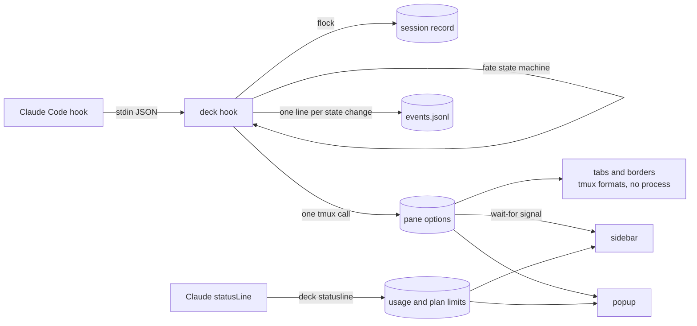
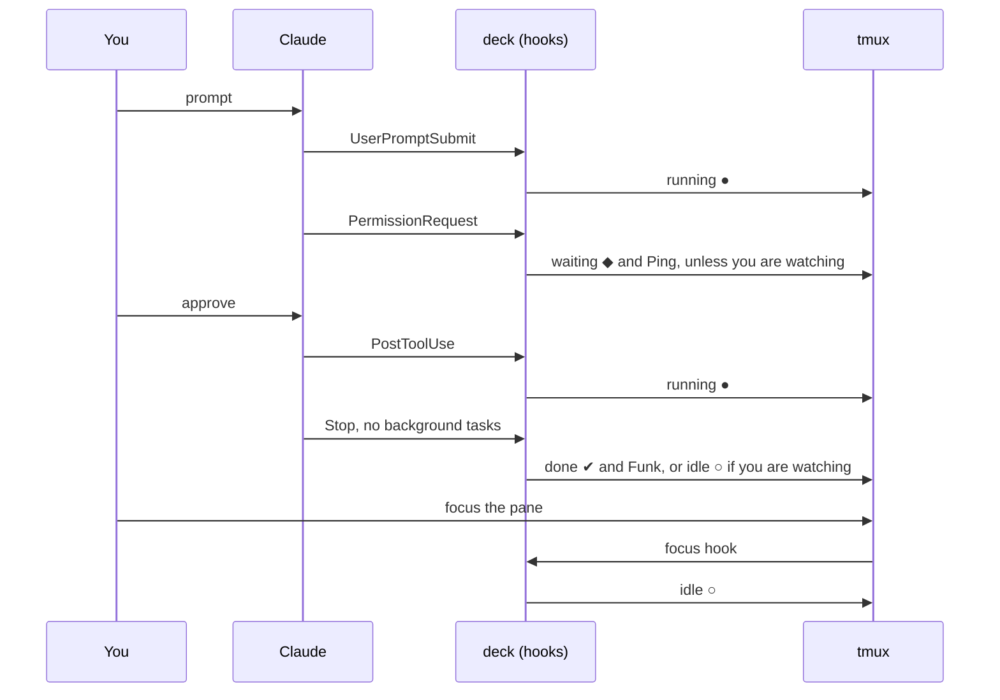
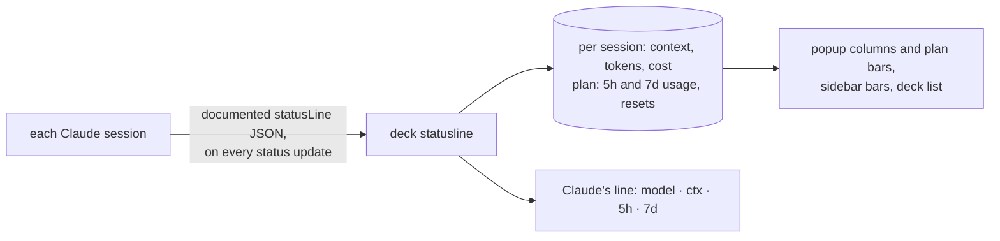
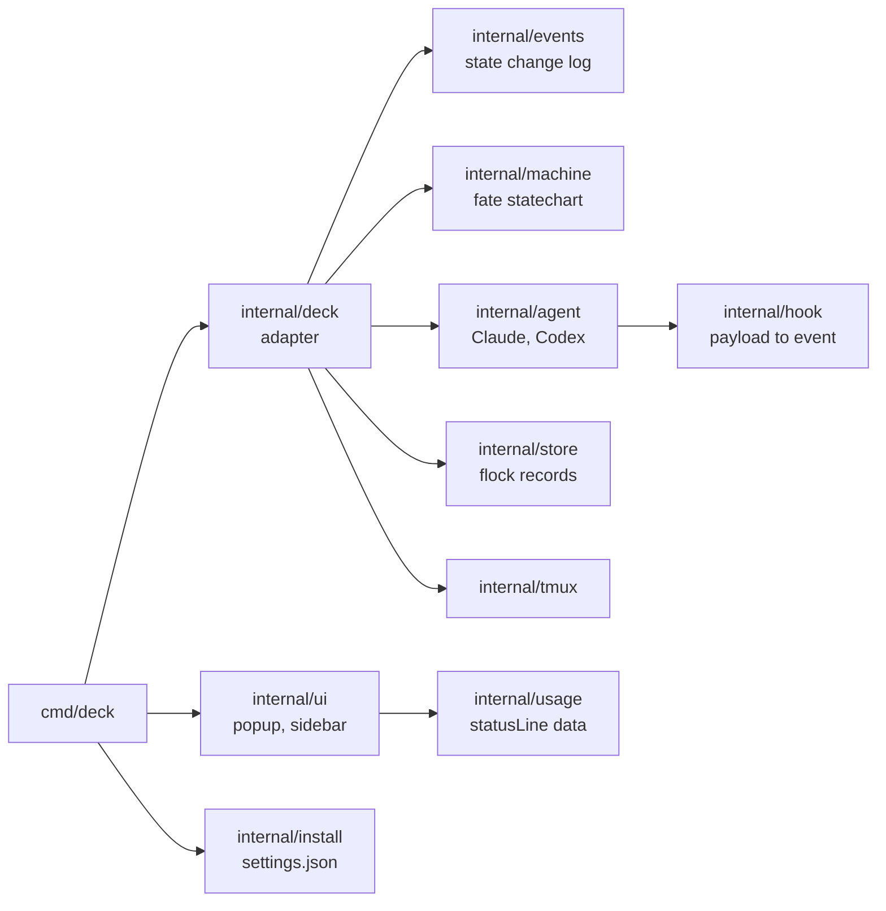

<h1 align="center">tmux-agent-deck</h1>

<p align="center">See which Claude Code agents need you, which have finished, and which are still working, across every tmux session.</p>

<p align="center">
  <a href="https://github.com/arisros/tmux-agent-deck/actions/workflows/ci.yml"></a>
  <a href="https://github.com/arisros/tmux-agent-deck/releases"></a>
  <a href="go.mod"></a>
  
  <a href="LICENSE"></a>
</p>


<sub>Two agents on a side project, the sidebar on the left. The home directory path is blurred, nothing else.</sub>

## Quickstart

Needs tmux 3.2+ and Claude Code (on 3.2 the popup has no border style or title). Go 1.26+ is optional: without it, the plugin downloads a release binary and checks its checksum.

```tmux
# ~/.tmux.conf (or ~/.config/tmux/tmux.conf), then prefix I
set -g @plugin 'arisros/tmux-agent-deck'
```

```sh
deck=~/.config/tmux/plugins/tmux-agent-deck/bin/deck   # or ~/.tmux/plugins/...
$deck install --claude            # preview the change to ~/.claude/settings.json
$deck install --claude --apply    # write it, with a backup
$deck doctor                      # every line should be ✔
```

Show state in your tabs and pane borders by adding the formats where you like:

```tmux
set -g window-status-format         ' #I:#W#{E:@deck_window_icon} '
set -g window-status-current-format ' #I:#W#{E:@deck_window_icon} '
set -g pane-border-format           ' #{pane_title}#{E:@deck_pane_icon} '
```

`prefix a` opens the popup, `prefix e` the sidebar.

## What it shows

| State | Glyph | Means | Clears when |
|---|---|---|---|
| waiting | ◆ white on red | Claude needs you, and the deck says for what: `permission Bash`, `question`, `elicitation`, or `dialog` when only the screen showed it | you answer it |
| done | ✔ blue | the turn finished while you were looking elsewhere | you look at the pane |
| running | ● green, pulsing ● ◉ ◎ ◉ | working, including background tasks Claude will resume from | the turn ends |
| idle | ○ grey | at the prompt, and you have seen it | you send a prompt |

| Where | What |
|---|---|
| **Popup** `prefix a` | every agent in every session, most urgent first, with context used, tokens, cost, and your plan's 5-hour and 7-day usage |
| **Sidebar** `prefix e` | this session's agents in a pane that follows you across windows, plus a one-line count of the other sessions |
| **Tabs and borders** | the icon of the most urgent agent in each window, and of each agent pane |
| **Sounds** | Ping when an agent starts waiting, Funk when it finishes, only for panes you are not looking at |

## Why

| Problem | What the deck does |
|---|---|
| Tab colors set by hooks never clear, so yellow means "asked once", not "blocked now" | a state machine with an explicit way out of every state |
| Agent dashboards that replace tmux mean a second multiplexer and a new keymap | a tmux plugin: your panes, keys and layouts stay as they are |
| Status plugins that poll every pane stall a busy server | event-driven: nothing runs between events, and a hook makes at most one tmux call |
| Hooks alone miss Esc and denied permissions (no event fires) | the screen is checked for Claude's own end markers when you leave the pane |

Measured on a private tmux server with 11 sessions, 64 windows and 120 panes (`make perf`, Apple M4):

| Path | p50 | p95 |
|---|---|---|
| hook with no state change (every tool call) | 4.7 ms | 6.4 ms |
| hook that changes state (a few per turn) | 11.9 ms | 15.7 ms |
| view refresh | 14.7 ms | 15.9 ms |
| state machine restore, send, persist | 12 µs | |

## How it works



One turn, from the deck's point of view:



The full machine, generated from the code: [docs/state-machine.md](docs/state-machine.md). Its transitions come from sequences recorded in real sessions ([test/fixtures](test/fixtures)), not only from the hook documentation. Some of what the recordings showed:

| Situation | Hooks | What the deck does |
|---|---|---|
| Esc during a turn, or a denied permission | none fire | when you leave the pane or open a view, reads the line above Claude's input box: `Interrupted` or `· done 4:12` means idle |
| a long command after you approved it | nothing until it ends | a waiting agent with no dialog on screen goes back to running |
| background tasks or subagents still running at `Stop` | `Stop` reports them | stays running; Claude resumes by itself when they finish |
| a turn Claude resumed after background work | no `Stop` at all | `idle_prompt` ends it |
| an agent that was idle when you installed the plugin | none yet | read from its screen once, then hooks take over |
| an agent that crashed or was killed | none | each hook remembers the pane's foreground command; once it changes, the agent is hidden at once and forgotten when a view opens |

The screen is only trusted for Claude's explicit markers (its dialogs, the spinner line, `esc to interrupt`, `Interrupted`, `· done`). A footer that merely looks quiet proves nothing: Claude hides `esc to interrupt` while a tool runs in auto mode.

## Keys

| Key | Popup | Sidebar (focus it first) |
|---|---|---|
| `j` `k`, arrows, wheel | move | move; the wheel scrolls even when unfocused |
| `g` `G` | top, bottom | top, bottom |
| `/` | filter | filter |
| Enter, `l`, → | jump to the agent, across sessions | jump to the agent |
| `x` then `y` | kill the agent's pane | kill the agent's pane |
| `q`, Esc | close | close the sidebar |

The sidebar keeps its place as the full-height left column: it follows you to other windows, comes back after `swap-pane`, `rotate-window` or a layout change, restores its width when squeezed, and leaves a window once it is the only pane left.

## Agents

| Agent | Install | Reported by hooks | Read from the screen | Usage and plan bars |
|---|---|---|---|---|
| Claude Code | `deck install --claude --apply` | everything but Esc and a denied permission | those two endings, and dialogs | yes, from its statusLine |
| Codex CLI 0.124+ | `deck install --codex --apply`, then `/hooks` in Codex to trust them | prompts, tools, permission requests, the end of a turn; a closed session from 0.145, Esc from 0.150 | dialogs and work in progress | no: Codex only writes them to its transcript, which the deck does not read |

Codex support is built from Codex's published hook schema and its interface source. It has not yet been replayed from recorded sessions the way Claude's transitions are, so treat it as experimental: a denied approval may show as running until your next prompt.

Each hook remembers the pane's foreground command, so an agent started through a wrapper (Codex from npm runs as `node`) is tracked and forgotten like any other.

## Usage and plan limits

`deck install --claude` also sets Claude Code's `statusLine` to `deck statusline`, unless you have a status line of your own. To keep yours and still feed the deck, add `--wrap-statusline`: Claude then runs the deck, which records the numbers and prints whatever your command prints. `deck uninstall` puts your command back exactly.



The deck reads no transcript files (their format is internal to Claude Code) and calls no API. The cost is Claude Code's own estimate; on a subscription, the 5-hour and 7-day percentages are the numbers that matter.

## Options

Set them before tpm loads the plugin.

| Option | Default | |
|---|---|---|
| `@deck-popup-key` | `a` | popup key (prefix table) |
| `@deck-sidebar-key` | `e` | sidebar toggle |
| `@deck-sidebar-width` | `34` | sidebar width in columns |
| `@deck-sidebar-pin` | `on` | put the sidebar back after swaps and layout changes |
| `@deck-tab-pulse` | `off` | pulse running agents in tabs and borders on any terminal: one `deck tick` per second while an agent runs, and `status-interval 1` (restored when turned off). Terminals that render blinking text pulse without it. |
| `@deck-sound` | `on` | sounds for panes you are not watching |
| `@deck-sound-command` | `afplay` (macOS), `paplay` (Linux) | player |
| `@deck-sound-waiting` | Ping.aiff, bell.oga | |
| `@deck-sound-done` | Funk.aiff, complete.oga | |
| `@deck-notify-command` | unset | a command run when an agent starts waiting or finishes, for panes you are not watching. It gets the state, the pane id and the reason: `waiting %12 permission Bash`, `done %12` |

### Notifications

The notify command runs inside tmux, next to the sound, so it costs no extra process until it fires. Only the state, the pane id and the reason are passed; ask tmux for anything else.

```sh
#!/bin/sh
# ~/.config/tmux/deck-notify.sh: $1 state, $2 pane, $3 and $4 the reason
where=$(tmux display-message -p -t "$2" '#{session_name}:#{window_index} #{pane_title}')
case "$(uname)" in
Darwin) osascript -e 'on run argv' -e 'display notification (item 2 of argv) with title (item 1 of argv)' -e 'end run' "agent $1 $3 $4" "$where" ;;
*) notify-send "agent $1 $3 $4" "$where" ;;
esac
```

```tmux
set -g @deck-notify-command '~/.config/tmux/deck-notify.sh'
```

Anything that takes arguments works the same way: a webhook with `curl`, a chat message, a log line.

## Troubleshooting

| Symptom | Look at |
|---|---|
| anything | `deck doctor` checks tmux, focus events, keys, hooks, statusLine, the sound player, stale agents and the binary |
| a state looks wrong | `deck events` lists every state change with what caused it (a hook, the screen, your focus); `--pane %12` narrows it, `--json` prints lines. It logs the stored state, so a turn you watched end reads `done` where the pane shows idle. `~/.local/state/tmux-agent-deck/views.log` adds the screen line a check relied on, and why a view closed |
| the plugin did not load | `bin/install.log` and `bin/init.log` in the plugin directory |
| old hook scripts color tabs or play sounds | remove them from `~/.claude/settings.json`; `deck doctor` flags tab coloring |
| remove everything | `deck uninstall --claude --apply`, then the `@plugin` line |

If the plugin is removed without uninstalling, its hooks become no-ops rather than errors.

## Development

```sh
make test    # unit, fixture replay, and integration tests on private tmux servers
make perf    # the 120-pane test and the state machine benchmark, run alone
make lint
make build   # bin/deck, stamped with git describe
```



Integration tests start their own `tmux -L deck-test-*` servers and never touch the server you work in. Fixtures are recorded with `deck install --claude --record`, cut with `scripts/fixture-from-record.sh`, and checked by a leak scanner that also reads private words from `DECK_LEAK_WORDS`. See [CONTRIBUTING.md](CONTRIBUTING.md).

## Roadmap

- [x] hook-driven state machine, with repairs for silent endings
- [x] popup across sessions, sidebar per session, tab and border icons
- [x] token usage and plan limits from the statusLine
- [x] release binaries with a checksummed download in the tpm entrypoint
- [ ] why an agent is waiting (permission, question), and a log of state changes
- [ ] clear agents whose Claude has exited, and a stricter `deck doctor`
- [ ] a command to run when an agent needs you

Then a tested tmux floor, Codex, and a preview you can answer from. The full order, the rules every change keeps, and what was declined: [docs/roadmap.md](docs/roadmap.md).

## Prior art

- **[herdr](https://herdr.dev)** is a terminal workspace built for coding agents, with an agent panel and state detection. Use it if you want a multiplexer made around agents; the deck exists for people who want to stay in tmux.
- **[tmux-handlr](https://github.com/CRThaze/tmux-handlr)** brings herdr's detection rules to tmux as status dots, a menu, a dashboard and a sidebar, reading each pane's screen.
- **[tmux-agent-pulse](https://github.com/jerriclynsjohn/tmux-agent-pulse)** is hook-driven like the deck and supports Codex too, with a popup and a sidebar.

The deck started after trying both plugins on a large server. It differs in being event-driven end to end, keeping one sidebar per session, and repairing the endings no hook reports.

MIT. See [LICENSE](LICENSE).
