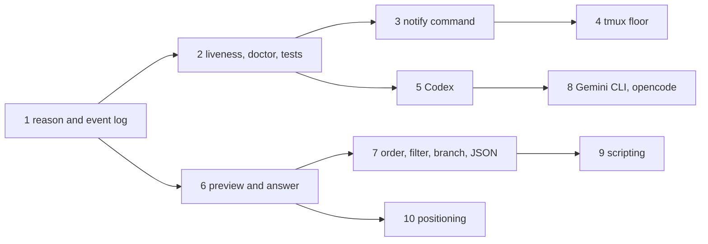

# Roadmap

Where the deck goes next, and what it will not become. The order is set by one goal: someone who is not the author can install it, trust it and use it with the agent they already run.

## What decides adoption

| Question a new user asks | Today | Planned |
|---|---|---|
| Does it support my agent? | Claude Code only | Codex, then Gemini CLI, then opencode |
| Does it work on my tmux? | tmux 3.3 is the stated floor but CI only runs newer versions; a user with their own statusLine gets no usage data | a CI job on tmux 3.3, a decision on 3.2, a statusLine wrapper |
| Does it ever lie to me? | a state machine with screen repair, replayed from recorded sessions | clear agents that have exited, fuzz the machine, record the missing scenarios |
| Does it save me a trip to the pane? | jump and kill, sounds | the reason an agent waits, a preview, answering from the popup, a notify command |

## Rules every change keeps

| Rule | Enforced by |
|---|---|
| Nothing runs between events, and a hook makes at most one tmux call | `test/integration/perf_test.go`, `TestHotPathSkipsTmux` |
| A state is never guessed: the screen is trusted only for an agent's explicit markers | `TestClassify`, [CONTRIBUTING.md](../CONTRIBUTING.md) |
| Prompts and tool arguments are never kept, only the event and the tool name | `internal/hook`, the fixture leak scanner |
| A hook stays under 8 ms with no state change and 18 ms with one (p50, 120 panes) | `make perf` |
| Your panes, keys and layouts stay as they are | integration tests on private tmux servers |

## Order

| # | Change | Contains |
|---|---|---|
| 1 | Show why an agent is waiting, and log state changes | `permission Bash`, `question`, `elicitation` or `dialog` beside a waiting agent; where each state came from (hook, screen, focus); an append-only `events.jsonl`; `deck events`; fixture replay that asserts every transition, not only the last |
| 2 | Clear agents that have exited | a pane that fell back to a shell loses its state and record at once instead of after 72 hours. Liveness compares the pane's foreground command with the one remembered at session start, so it needs no list of process names; doctor checks for stale state, the sound player and the key bindings; fuzzing over event sequences; fixtures for resume, compaction, a crash, a failed tool and an elicitation |
| 3 | Run a command when an agent needs you | one `@deck-notify-command` beside the sound, run by tmux in the same call; README recipes for desktop notifications |
| 4 | Prove the tmux floor | a CI job on tmux 3.3a; one run of the suite on 3.2a with a plainer popup, then a decision on lowering the floor; `deck statusline` wrapping a status line you already have |
| 5 | Codex | hooks merged into `~/.codex/hooks.json`; the provider boundary (detect, map, classify, install) extracted here, when a second provider proves its shape. See the costs below |
| 6 | Preview and answer from the popup | the selected agent's screen; mark seen, interrupt, send text. Text is only ever sent to a pane whose agent is still alive, never to a shell |
| 7 | Order, filter, context | oldest first inside a state; `state:` `session:` `path:` `reason:` `branch:` filters; the git branch read from `.git/HEAD` with no `git` process; `deck list --json` with consistent keys, session id, reason and usage |
| 8 | Gemini CLI, then opencode | Gemini through its hooks, opencode through a plugin file that runs `deck hook` |
| 9 | Scripting | `deck events --follow`, `deck send`, `deck interrupt`, `deck wait`, all blocking on tmux's own `wait-for` rather than polling |
| 10 | Positioning | once the deck can act as well as show: a new tagline, and a written compatibility policy for `@deck-*` options, key bindings and the state directory |

## What each agent reports

Read from each project's source and documentation on 2026-10-02. None of it has been recorded from a live session yet, and the deck's transitions only ever come from recordings, so every agent starts with fixtures.

| Deck need | Claude Code | Codex 0.150+ | Gemini CLI 0.62 | opencode 1.18 |
|---|---|---|---|---|
| Mechanism | hooks in `settings.json` | hooks in `~/.codex/hooks.json`, same shape | hooks in `~/.gemini/settings.json`, same shape | a plugin file in `~/.config/opencode/plugins/` |
| Payload | JSON on stdin | same field names | same field names | built by the plugin |
| Event names | baseline | identical | different (`BeforeAgent`, `AfterTool`) | different (`session.idle`, `permission.asked`) |
| Session end | `SessionEnd` | `SessionEnd`, from 0.145 | `SessionEnd` | none on exit |
| Waiting | `PermissionRequest`, `Notification` | `PermissionRequest`, from 0.124 | `Notification` of type `ToolPermission` | `permission.asked`, `question.asked` |
| A denied permission | no event, read from the screen | no event found | no event | `permission.replied` with `reject` |
| Interrupt | no event, read from the screen | `Interrupt`, from 0.150 | unknown | `session.error`, then `session.idle` |
| Background work at the end of a turn | reported by `Stop` | not reported; the screen says `background terminal running` | unknown | not found |
| Process name tmux sees | its version number, or `claude` | `node` when installed from npm | not observed | `opencode`, or `node` from npm |
| Usage for another program | statusLine JSON | none outside its transcript file | not checked | tokens and cost per message |

What that costs:

| Agent | Cost |
|---|---|
| Codex | hooks do not run until you approve them with `/hooks` inside Codex, so `deck install` cannot finish alone; 0.150 or newer for interrupts and session ends; no context or plan bars, because the deck reads no transcript files |
| Gemini CLI | event names need translating; its environment sanitizing may hide `TMUX_PANE` from hooks |
| opencode | works only when the TUI hosts its own server, not with `opencode attach`; the plugin API has changed names between releases, so the plugin needs a version floor |

## tmux versions

The floor is 3.3 because the popup uses `display-popup -b` and `-T`. Nothing else in the plugin needs more than 3.2.

| Excluded by the floor, and still supported | tmux | Until |
|---|---|---|
| Ubuntu 22.04 | 3.2a | 2027-06 |
| RHEL, Rocky and Alma 9 | 3.2a | 2027-05 |

Ubuntu 24.04 and 26.04, Debian 12 and 13, EL 10, Fedora, Amazon Linux 2023, Alpine, Arch, Homebrew and nix all ship 3.3a or newer.

Dropping the two flags is not the whole cost of 3.2: before 3.3, `window-layout-changed` does not fire on `swap-pane` (the sidebar would miss swaps), focus events arrive in a different order, and `{}` parsing differs. Step 4 runs the suite on 3.2a once and decides from the result.

## Considered and declined

| Idea | Why not |
|---|---|
| More states (blocked, failed, unknown) | no hook reports them, so they would be guesses. A reason on the existing states carries what is actually known |
| A confidence score per state | there is no honest source for the number. The source of a state says the same thing truthfully |
| Storing the command or question an agent is waiting on | it would put prompts and tool arguments on disk. The preview shows the real dialog live, with nothing kept |
| Changed file and test counts per agent | a `git` process per agent on every refresh |
| Kanban and switchable layouts | interface surface with no pull; tabs, borders, the sidebar and the popup already cover compact to detailed |
| A webhook system and built-in Slack or Telegram | the notify command covers all of them in one option |
| A socket or HTTP API | it needs a process that stays alive. The CLI with JSON output is the API |
| Provider-neutral types before a second provider exists | an abstraction drawn from one example is a guess at the second |
| A Homebrew tap, for now | brew would install only the binary. The plugin runs the copy in its own directory, which tpm already downloads with a checksum, so a tap adds a second copy and nothing a tmux user needs |

## Non-goals

- a terminal multiplexer, a PTY layer or a terminal emulator: tmux is the runtime
- a daemon, or any process that outlives the event that started it
- reading transcript files, or calling a model provider's API
- remote machines and SSH session management
- a web dashboard
