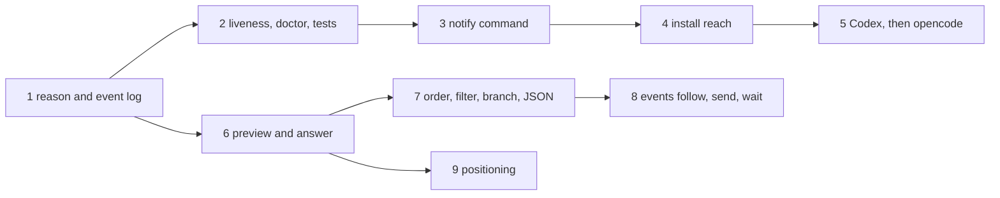

# Roadmap

Where the deck goes next, and what it will not become. The order is set by one goal: someone who is not the author can install it, trust it and use it with the agent they already run.

## What decides adoption

| Question a new user asks | Today | Planned |
|---|---|---|
| Does it support my agent? | Claude Code only | Codex, then opencode |
| Can I install it in one line, on my tmux? | tpm plus `deck install`; tmux 3.3 is the stated floor but CI only runs newer versions; a user with their own statusLine gets no usage data | Homebrew tap, a CI job on tmux 3.3, a statusLine wrapper |
| Does it ever lie to me? | a state machine with screen repair, replayed from recorded sessions | clear agents whose Claude exited, fuzz the machine, record the missing scenarios |
| Does it save me a trip to the pane? | jump and kill, sounds | the reason an agent waits, a preview, answering from the popup, a notify command |

## Rules every change keeps

| Rule | Enforced by |
|---|---|
| Nothing runs between events, and a hook makes at most one tmux call | `test/integration/perf_test.go`, `TestHotPathSkipsTmux` |
| A state is never guessed: the screen is trusted only for Claude's explicit markers | `TestClassify`, [CONTRIBUTING.md](../CONTRIBUTING.md) |
| Prompts and tool arguments are never kept, only the event and the tool name | `internal/hook`, the fixture leak scanner |
| A hook stays under 8 ms with no state change and 18 ms with one (p50, 120 panes) | `make perf` |
| Your panes, keys and layouts stay as they are | integration tests on private tmux servers |

## Order

| # | Change | Contains |
|---|---|---|
| 1 | Show why an agent is waiting, and log state changes | `permission Bash`, `question`, `elicitation` or `dialog` beside a waiting agent; where each state came from (hook, screen, focus); an append-only `events.jsonl`; `deck events`; fixture replay that asserts every transition, not only the last |
| 2 | Clear agents whose Claude has exited | a pane that fell back to a shell loses its state and record at once instead of after 72 hours; doctor checks for stale state, the sound player and the key bindings; fuzzing over event sequences; fixtures for resume, compaction, a crash, a failed tool and an elicitation |
| 3 | Run a command when an agent needs you | one `@deck-notify-command` beside the sound, run by tmux in the same call; README recipes for desktop notifications |
| 4 | Install reach | Homebrew tap; CI on tmux 3.3; `deck statusline` wrapping a status line you already have |
| 5 | Other agents | Codex first, then opencode, after checking what each one reports. The provider boundary (detect, map, classify, install) is extracted here, when a second provider proves its shape |
| 6 | Preview and answer from the popup | the selected agent's screen; mark seen, interrupt, send text. Text is only ever sent to a pane whose foreground process is still the agent, never to a shell |
| 7 | Order, filter, context | oldest first inside a state; `state:` `session:` `path:` `reason:` `branch:` filters; the git branch read from `.git/HEAD` with no `git` process; `deck list --json` with consistent keys, session id, reason and usage |
| 8 | Scripting | `deck events --follow`, `deck send`, `deck interrupt`, `deck wait`, all blocking on tmux's own `wait-for` rather than polling |
| 9 | Positioning | once the deck can act as well as show: a new tagline, and a written compatibility policy for `@deck-*` options, key bindings and the state directory |

## Considered and declined

| Idea | Why not |
|---|---|
| More states (blocked, failed, unknown) | no hook reports them, so they would be guesses. A reason on the existing states carries what is actually known |
| A confidence score per state | there is no honest source for the number. The source of a state says the same thing truthfully |
| Storing the command or question an agent is waiting on | it would put prompts and tool arguments on disk. The preview shows the real dialog live, with nothing kept |
| Changed file and test counts per agent | a `git` process per agent on every refresh |
| Kanban and switchable layouts | interface surface with no pull; tabs, borders, the sidebar and the popup already cover compact to detailed |
| A webhook system and built-in Slack or Telegram | the notify command covers all of them in one option |
| A socket or HTTP API | it needs a process that stays alive. The CLI with JSON output is the API |
| Provider-neutral types before a second provider exists | an abstraction drawn from one example is a guess at the second |

## Non-goals

- a terminal multiplexer, a PTY layer or a terminal emulator: tmux is the runtime
- a daemon, or any process that outlives the event that started it
- reading transcript files, or calling a model provider's API
- remote machines and SSH session management
- a web dashboard
