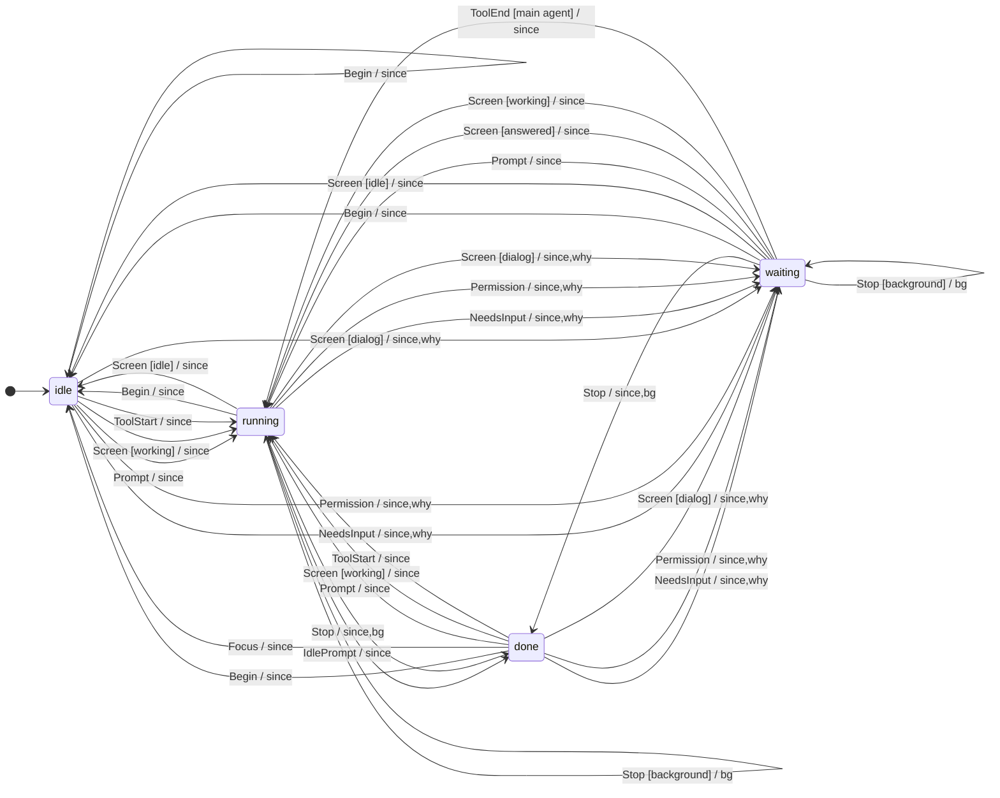

# State machine

Generated by `go test ./internal/machine -update` from the machine itself.

```mermaid
stateDiagram-v2
    direction LR
    [*] --> s_idle
    state "done" as s_done
    state "idle" as s_idle
    state "running" as s_running
    state "waiting" as s_waiting
    s_done --> s_idle : Begin / since
    s_done --> s_idle : Focus / since
    s_done --> s_running : Prompt / since
    s_done --> s_running : Screen [working] / since
    s_done --> s_running : ToolStart / since
    s_done --> s_waiting : NeedsInput / since,why
    s_done --> s_waiting : Permission / since,why
    s_done --> s_waiting : Screen [dialog] / since,why
    s_idle --> s_idle : Begin / since
    s_idle --> s_running : Prompt / since
    s_idle --> s_running : Screen [working] / since
    s_idle --> s_running : ToolStart / since
    s_idle --> s_waiting : NeedsInput / since,why
    s_idle --> s_waiting : Permission / since,why
    s_idle --> s_waiting : Screen [dialog] / since,why
    s_running --> s_done : IdlePrompt / since
    s_running --> s_done : Stop / since,bg
    s_running --> s_idle : Begin / since
    s_running --> s_idle : Screen [idle] / since
    s_running --> s_running : Stop [background] / bg
    s_running --> s_waiting : NeedsInput / since,why
    s_running --> s_waiting : Permission / since,why
    s_running --> s_waiting : Screen [dialog] / since,why
    s_waiting --> s_done : Stop / since,bg
    s_waiting --> s_idle : Begin / since
    s_waiting --> s_idle : Screen [idle] / since
    s_waiting --> s_running : Prompt / since
    s_waiting --> s_running : Screen [answered] / since
    s_waiting --> s_running : Screen [working] / since
    s_waiting --> s_running : ToolEnd [main agent] / since
    s_waiting --> s_waiting : Stop [background] / bg
```
